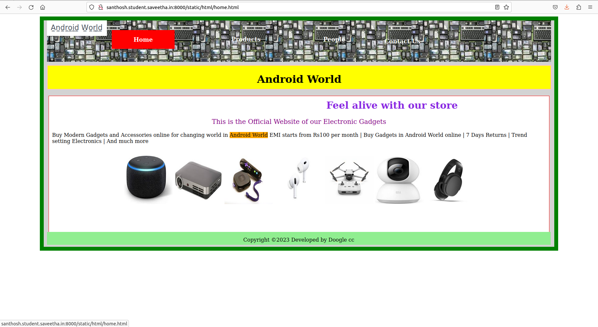
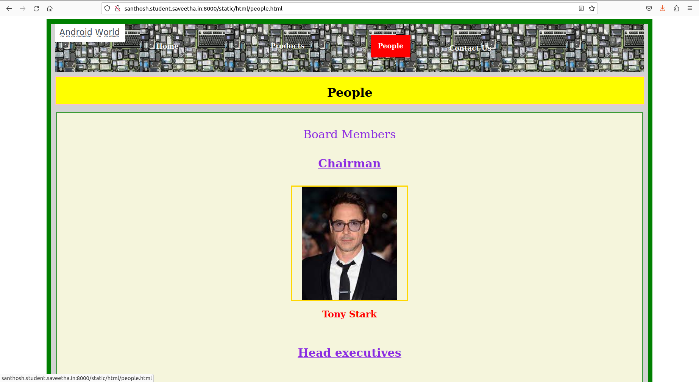
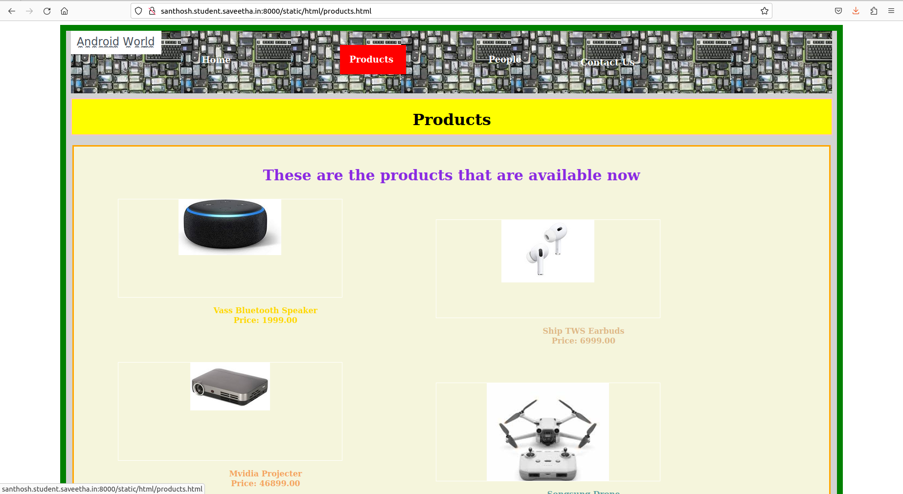
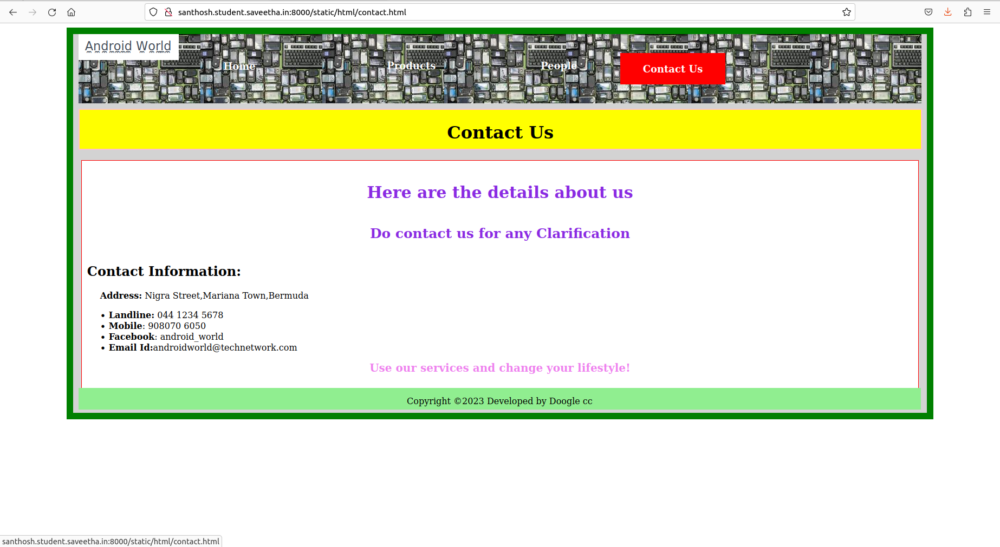

# Product Development Company Website

# AIM:

To design a website for a software product development company.

## DESIGN STEPS:

### Step 1:

Create a new folfer and change directory to it.

### Step 2:

Clone the respected repository.Create a new project using command "django-admin startproject <#project name#>".

### Step 3:

Create a new folder "static".In static,create html and css folder and files.HTML content creation is done.

### Step 4:

Design of webserver workflow.Implementation using Python code.Serving the HTML pages.

### Step 5:

Testing the webserver

## PROGRAM:
### styles.css
```
    .home{
            height: 700px;
            width: 85%;
            border: 12px solid green;
            padding-left:10px;
            padding-right:10px;
            margin-left: auto;
            margin-right:auto;
            background-color:lightgray;
        }
        .content{
            border:1px solid whitesmoke;
            background-color:greenyellow;
            width:95%;
            height:1190px;
            padding:10px;
            margin-left:auto;
            margin-right:auto;
        }
        .header{
            height: 128px;
            width:100%;
            background-image: url(/static/images/header.jpeg);
            background-size: header;
            
        }
        .logo{
            height:5%;
            width: 10%;
            position:absolute;
            background-image: url(/static/images/androidlogo.png);
            background-size: absolute;
            
        }
        .prod{
            height:auto;
            width:auto;
            position:relative;
            bottom:10px;
            left:550px;
            border:4px solid transparent;
            text-align:center;
            display: inline;
            padding:15px;
            font-family:'Gill Sans MT';
            font-size: large;  
        }
        .prod:hover{
            background-color:red;
        }
        .people{
            height:auto;
            width:auto;
            position:relative;
            bottom:10px;
            left:700px;
            border:4px solid transparent;
            text-align:center;
            display: inline;
            padding:15px;
            font-family:'Gill Sans MT';
            font-size: large;  
        }
        .people:hover{
            background-color:red;
        }
        .contact{
            height:20px;
            width:10%;
            position:relative;
            bottom:45px;
            left:1000px;
            border:4px solid transparent;
            text-align:center;
            padding:15px;
            font-family:'Gill Sans MT';
            font-size: large;  
        }
        .contact:hover{
            background-color:red;
        }
                
        .h{
            height:20px;
            width:10%;
            position:relative;
            top:30px;
            left:200px;
            border:4px solid transparent;
            text-align:center;
            
            padding:15px;
            font-family:'Gill Sans MT';
            font-size: large;  
        }
        .h:hover{
            background-color:red;
            overflow:hidden;
        }
        .footer{
            border: 15px solid lightgreen;
            width:98%;
            height:10px;
            position:relative;
            bottom: 1px;
            background-color:lightgreen;
            text-align:center;

        }
        .title{
            border:2px solid pink;
            background-color:yellow;
            padding:1px;
            width:99.7%;
            height: 70px;
            text-align:center;
            font-family:'Impact';
            margin-left:auto;
            margin-right: auto;
            
        }
        .content{
            border:1px solid red;
            background-color: white;
            width:98%;
            height:400px;
            padding:10px;
            margin-left:auto;
            margin-right:auto;

        }
```
### home.html
```
<!DOCTYPE html>
<html lang="en">
    <head>
        <title>
            Home Page
        </title>
        <meta name="viewport" 
         content="width=device-width, initial-scale=1.0">
        <link rel="stylesheet" href="/static/css/styles.css">
    <style>
    .text{
        color:blueviolet;
        font-family:'Lucida Sans';
        font-size: 30px;
        text-align:center;
    }
    img{
        height: 150px;
        width: 150px;
        align-items:center;
    }
    </style>

    </head>
    <body>
        <div class="home">
            <div class="header">
                <header>
                    <div class=logo></div>
                    <div class=h>
                    <a href="home.html" title="Home" style="color:white; text-decoration: none;"><b>Home</b></a></div>
                    <div class="prod">
                        <a href="products.html" title="Products" style="color: white; text-decoration: none;"><b>Products</b></a>
                    </div>
                    <div class="people">
                        <a href="people.html" title="People" style="color:white; text-decoration: none;"><b>People</b></a>
                    </div>
                    <div class="contact">
                        <a href="contact.html" title="Contact Us" style="color:white; text-decoration: none;"><b>Contact Us</b></a>
                    </div>
                </header>
                <div class="title">
                    <h1>Android World</h1>
                </div><br>
                <div class="content">
                    <div class="text">
                    <marquee><b>Feel alive with our store</b></marquee>
                    <p style="color:purple; font-family:'Tahoma'; font-size:20px;"> This is the Official Website of our Electronic Gadgets</p>
                    </div>
                    <p>Buy Modern Gadgets and Accessories online for changing world in <span style="background-color:orange"> Android World</span>
                         EMI starts from Rs100 per month | Buy Gadgets in Android World online | 7 Days Returns | Trend setting Electronics | And much more</p>
                    <br>
                <center>
                    
                    
                    
                    
                    
                    
                    
                </center>
                </div>
                <div class="footer">
                <footer style="color:black">
                Copyright &copy;2023 Developed by Doogle cc</footer></div>
            </div>
        </div>
    </body>
</html>
```
### products.html
```
<!DOCTYPE html>
<html lang="en">
    <head>
        <title>
            Products
        </title>
        <meta name="viewport" content="width=device-width, initial-scale=1.0">
        <link rel="stylesheet" href="/static/css/styles.css">
        <style>
        .home{
            height: 1555px;
            width: 85%;
            border: 12px solid green;
            padding-left:10px;
            padding-right:10px;
            margin-left: auto;
            margin-right:auto;
            background-color:lightgray;
        }
        .text{
            color:blueviolet;
            font-family:'Lucida Sans';
            font-size: 30px;
            text-align:center;
        
        }
        .content{
            border:3px solid orange;
            background-color: beige;
            width:98%;
            height:1190px;
            padding:10px;
            margin-left:auto;
            margin-right:auto;
        }
        .ph1{
            background-image: url(/static/images/product1.jpeg);
            background-size: 210px;
            background-position-x: center;
            background-repeat: no-repeat;
            border:1px solid white;
            height:200px;
            width:30%;
            position:relative;
            left: 80px;
        }
        .l1{
            color: gold;
            position:relative;
            right:380px;
            
            
        }
        .ph2{
            background-image: url(/static/images/product2.jpeg);
            background-size: 163px;
            background-position-x: center;
            background-repeat: no-repeat;
            border:1px solid white;
            height:200px;
            width:30%;
            position:relative;
            left: 80px;
            
        }
        .l2{
            color: sandybrown;
            position:relative;
            right:380px;
        }
        .ph3{
            background-image: url(/static/images/product3.jpeg);
            background-size: 185px;
            background-position-x: center;
            background-repeat: no-repeat;
            border:1px solid white;
            height:210px;
            width:30%;
            position:relative;
            left: 80px;
            
        }
        .l3{
            color: burlywood;
            position:relative;
            right:380px;
        }
        .ph4{
            background-image: url(/static/images/product4.jpeg);
            background-position-x: center;
            border:1px solid white;
            height:200px;
            width:30%;
            position:relative;
            left: 730px;
            bottom:930px;
            background-size: 190px;
            background-repeat: no-repeat;
            
            
        }
        .l4{
            color: burlywood;
            position:relative;
            left:270px;
            bottom: 930px;
        }
    
        .ph5{
            background-image: url(/static/images/product5.jpeg);
            background-position-x: center;
            border:1px solid white;
            height:200px;
            width:30%;
            position:relative;
            left: 730px;
            bottom:930px;
            background-size: 250px;
            background-repeat: no-repeat;
            
            
        }
        .l5{
            color: cadetblue;
            position:relative;
            left:270px;
            bottom: 930px;
        }

        .ph6{
            background-image: url(/static/images/product6.jpeg);
            background-position-x: center;
            border:1px solid white;
            height:200px;
            width:30%;
            position:relative;
            left: 730px;
            bottom:930px;
            background-size: 200px;
            background-repeat: no-repeat;
            
            
        }
        .l6{
            color: crimson  ;
            position:relative;
            left:270px;
            bottom: 930px;
        }
        .bot{
            text-align:center;
            font-size:larger;
            color:black;

        }
        </style>
    </head>
    <body>
        <div class="home">
            <div class="header">
                <header>
                    <div class=logo></div>
                    <div class=h>
                    <a href="home.html" title="Home" style="color: white; text-decoration: none;"><b>Home</a></div>
                    <div class="prod">
                        <a href="products.html" title="Products" style="color: white; text-decoration: none;"><b>Products</b></a>
                    </div>
                    <div class="people">
                        <a href="people.html" title="People" style="color:white; text-decoration: none;"><b>People</b></a>
                    </div>
                    <div class="contact">
                        <a href="contact.html" title="Contact Us" style="color:white; text-decoration: none;"><b>Contact Us</b></a>
                    </div>
                </header>
                <div class="title">
                    <h1>Products</h1>
                </div><br>
                <div class="content">
                    <div class="text">
                    <p>These are the products that are available now</p>
                    </div>
                    <div class="ph1"></div>
                    <div class="l1"><p align="center"><b>Vass Bluetooth Speaker<br> Price: 1999.00</b><br><br><br><br></p></div>
                    <div class="ph2"></div>
                    <div class="l2"><p align="center"><b>Mvidia Projecter<br> Price: 46899.00</b><br><br><br><br></p></div>
                    <div class="ph3"></div>
                    <div class="l3"><p align="center"><b>Smoketel Smart Box<br> Price: 4999.00</b><br<br><br><br></p></div>
                    <div class="ph4"></div>
                    <div class="l4"><p align="center"><b>Ship TWS Earbuds<br> Price: 6999.00</b><br><br><br><br></p></div>
                    <div class="ph5"></div>
                    <div class="l5"><p align="center"><b>Songsung Drone<br> Price: 93999.00</b><br><br><br><br></p></div>
                    <div class="ph6"></div>
                    <div class="l6"><p align="center"><b>Pikon 360 Camera<br> Price: 35999.00</b><br><br><br><br></p></div>
         
                </div>
                <div class="bot"><p>To Order Online: Call 908070 6050</p></div>

                <div class="footer">
                <footer style="color:black">
                Copyright &copy;2023 Developed by Doogle cc</footer></div>
            </div>
        </div>
    </body>
</html>
```
### people.html
```
<!DOCTYPE html>
<html lang="en">
    <head>
        <title>
            People
        </title>
        <meta name="viewport" content="width=device-width, initial-scale=1.0">
        <link rel="stylesheet" href="/static/css/styles.css">
        <style>
        .home{
            height: 3000px;
            width: 85%;
            border: 12px solid green;
            padding-left:10px;
            padding-right:10px;
            margin-left: auto;
            margin-right:auto;
            background-color:lightgray;
        }
        .text{
        color:blueviolet;
        font-family:'Lucida Sans';
        font-size: 30px;
        text-align:center;
        
        }
        .content{
            border:2px solid green;
            background-color:beige;
            width:98%;
            height:2690px;
            padding:10px;
            margin-left:auto;
            margin-right:auto;
        }
        .ceoph{
            background-image: url(/static/images/member1.jpeg);
            background-size: 250px;
            background-position-x: center;
            background-repeat: no-repeat;
            border:3px solid gold;
            height:300px;
            width:20%;
            position:relative;
            left: 0px;
            margin-left:auto;
            margin-right: auto;
        }
        .ceo{
            color: red;
            position:relative;
            text-align:center;
            
            
        }
        .manph1{
            background-image: url(/static/images/member2.jpeg);
            background-size: 250px;
            background-position-x: center;
            background-repeat: no-repeat;
            border:1px solid black;
            height:300px;
            width:20%;
            position:relative;
            margin-left:auto;
            margin-right:auto;            
        }
        .man1{
            color: red;
            position:relative;
            text-align:center;
            
        }
        .manph2{
            background-image: url(/static/images/member3.jpeg);
            background-size: 250px;
            background-position-x: center;
            background-repeat: no-repeat;
            border:1px solid black;
            height:300px;
            width:20%;
            position:relative;
            margin-left:auto;
            margin-right:auto;

            
        }
        .man2{
            color: red;
            position:relative;
            text-align:center;
        }
        
        .amph1{
            background-image: url(/static/images/member4.jpeg);
            background-size: 250px;
            background-position-x: center;
            background-repeat: no-repeat;
            border:1px solid black;
            height:300px;
            width:20%;
            position:relative;
            margin-left:auto;
            margin-right:auto;

            
        }
        .am1{
            color: red;
            position:relative;
            text-align:center;
        }

        .amph2{
            background-image: url(/static/images/member5.jpeg);
            background-size: 250px;
            background-position-x: center;
            background-repeat: no-repeat;
            border:1px solid black;
            height:270px;
            width:20%;
            position:relative;
            margin-left:auto;
            margin-right:auto;

            
        }
        .am2{
            color: red;
            position:relative;
            text-align:center;
        }
        .amph3{
            background-image: url(/static/images/member6.jpeg);
            background-size: 250px;
            background-position-x: center;
            background-repeat: no-repeat;
            border:1px solid black;
            height:250px;
            width:20%;
            position:relative;
            margin-left:auto;
            margin-right:auto;

            
        }
        .am3{
            color: red;
            position:relative;
            text-align:center;
        }
        </style>
    </head>
    <body>
        <div class="home">
            <div class="header">
                <header>
                    <div class=logo></div>
                    <div class=h>
                    <a href="home.html" title="Home" style="color:white; text-decoration: none;"><b>Home</b></a></div>
                    <div class="prod">
                        <a href="products.html" title="Products" style="color: white; text-decoration: none;"><b>Products</b></a>
                    </div>
                    <div class="people">
                        <a href="people.html" title="People" style="color:white; text-decoration: none;"><b>People</b></a>
                    </div>
                    <div class="contact">
                        <a href="contact.html" title="Contact Us" style="color:white; text-decoration: none;"><b>Contact Us</b></a>
                    </div>
                </header>
                <div class="title">
                    <h1>People</h1>
                </div><br>
                <div class="content">
                    <div class="text">
                    <p>Board Members</p>
                    <h4><u>Chairman</u></h4>
                    </div>
                    <div class="ceoph"></div>
                    <div class="ceo"><p align="center"><b><h2>Tony Stark</h2></b></div>
                    <br>
                    <div class="text">
                        <p><b><u>Head executives</u></b></p><br>
                    </div>
                    <div class="manph1"></div>
                    <div class="man1"><p align="center"><b><h2>Dani Miranda</h2></b></p></div>
                    <div class="manph2"></div>
                    <div class="man2"><p><b><h2>Nathen Drake</h2></b></p></div>
                    <br>
                    <div class="text"><p><b><u>Managers</u></b></p></div><br>
                    <div class="amph1"></div>
                    <div class="am1"><p align="center"><b><h2>Teth Adam</h2></b></p></div>
                    <div class="amph2"></div>
                    <div class="am2"><p align="center"><b><h2>Wade Wilson</h2></b></p></div>
                    <div class="amph3"></div>
                    <div class="am3"><p align="center"><b><h2>Diana Prince</h2></b></p></div><br>
                    <div class="text">Thank you so much for your kind support!<br>Hope our products had made you day a Blaze....!</div>
                </div>
                <div class="footer">
                <footer style="color:black">
                Copyright &copy;2023 Developed by Doogle cc</footer></div>
            </div>
        </div>
    </body>
</html>
```
### contact.html
```
<!DOCTYPE html>
<html lang="en">
    <head>
        <title>
            Contact Us
        </title>
        <meta name="viewport" 
         content="width=device-width, initial-scale=1.0">
        <link rel="stylesheet" href="/static/css/styles.css">
    <style>
    .text{
        color:blueviolet;
        font-family:'Lucida Sans';
        font-size: 30px;
        text-align:center;
    }
    
    </style>

    </head>
    <body>
        <div class="home">
            <div class="header">
                <header>
                    <div class=logo></div>
                    <div class=h>
                    <a href="home.html" title="Home" style="color: white; text-decoration: none;"><b>Home</b></a></div>
                    <div class="prod">
                        <a href="products.html" title="Products" style="color: white; text-decoration: none;"><b>Products</b></a>
                    </div>
                    <div class="people">
                        <a href="people.html" title="People" style="color:white; text-decoration: none;"><b>People</b></a>
                    </div>
                    <div class="contact">
                        <a href="contact.html" title="Contact Us" style="color:white; text-decoration: none;"><b>Contact Us</b></a>
                    </div>
                </header>
                <div class="title">
                    <h1>Contact Us</h1>
                </div><br>
                <div class="content">
                    <div class="text">
                    <p><b>Here are the details about us
                    <h5>Do contact us for any Clarification</h5></b></p>
                    
                    </div>
                    <b><h2>Contact Information:</h2></b>
                    <p><b>&emsp;&ensp;Address:</b>
                        Nigra Street,Mariana Town,Bermuda
                    </p>
                    <ul>
                        <li><b>Landline:</b> 044 1234 5678</li>
                        <li><b>Mobile</b>: 908070 6050</li>
                        <li><b>Facebook</b>: android_world</li>
                        <li><b>Email Id:</b>androidworld@technetwork.com</li>
                    </ul>
                    <div style="text-align: center;color:violet;font-size:20px;"><b>Use our services and change your lifestyle!</b></div>

                </div>
                <div class="footer">
                <footer style="color:black">
                Copyright &copy;2023 Developed by Doogle cc</footer></div>
            </div>
        </div>
    </body>
</html>
```

## OUTPUT:
### Home Page

### People Page

### Product Page

### Contact Page


## RESULT:
The program to develop a website for a software product development company is executed successfully
